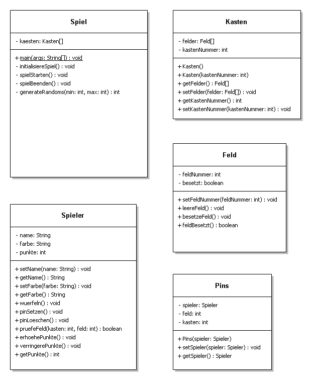
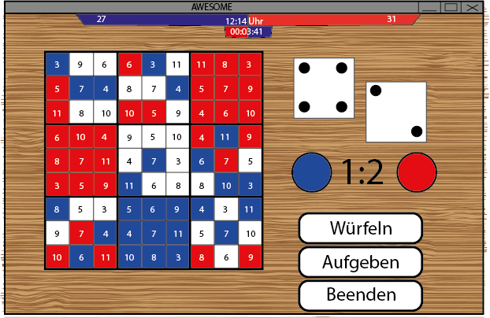

# Awesome App - Projektplan

## Softwareentwurf

### Nutzeraktionen
- Namen eingeben
- Spiel starten
- Würfeln
- gültiges Feld setzen
- gegnerische Felder frei räumen

### Ablaufplan

### Programmteile
Pin, Farbe, Feld, Kästchen, Spielfeld, Würfel, würfeln, Spieler, Name, Regeln, Felder shuffeln, Feld belegen, Feld entfernen, Kästchen belegen, Gewinnen, Verlieren, Unentschieden, Spielende

### Klassendiagramm

### Relevante Daten
- Namen der Spieler
- Gewonnen / Verloren / Unentschieden -> isRunning
- Position eines Pins

### Oberflächenentwurf

## Testplan
- normales Ziehen -> Feld nur belegbar mit richtiger Zahl?
- nur diagonal, waagerecht oder senkrecht (mit eigenen Pins) gewinnt Kasten / Spielfeld
- Sonderregeln:
  - 12: überall setzen
  - 7: mittleres Feld setzen
  - 2: Pin entfernen (nur Feind, keine eigenen)
  - Zahl würfeln -> können alle(mit Ausnahme des Mittleren) Felder im nummerierten Kästchen belegt werden?/ in andere verboten!
- Pins aus bereits gesicherten(gewonnenen) Kästchen dürfen nicht entfernt werden (Feind/Eigene)
- Feld schon belegt -> darf nicht nochmal belegt werden (Feind/Eigene)
- gewonnen/verloren/unentschieden -> wirklich beendet mit letztem Zug den der Gewinner macht?
- Spielernamen variabel?
- Zufallsprinzip des ersten Zuges (gerecht?)
- funktioniert der Spielerwechsel (besonders mit 2*würfeln)

## Zeitplanung

### Milestones

1. Klassendiagramm
2. Projektplan
3. Pseudocode
4. Testcode
5. Ausbau Datenschicht
6. Ausbau Controllerschicht
7. Ausbau View (später GUI)
8. Design GUI
9. Verknüpfung GUI & Controller

### Zeitplan

|KW|Aktion|
|:----:|:----|
|bis 49|Projektplan erstellen|
|49-50|Logik und Daten programmieren|
|ab 51|GUI programmieren & einbinden|